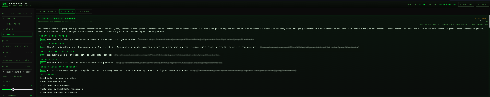
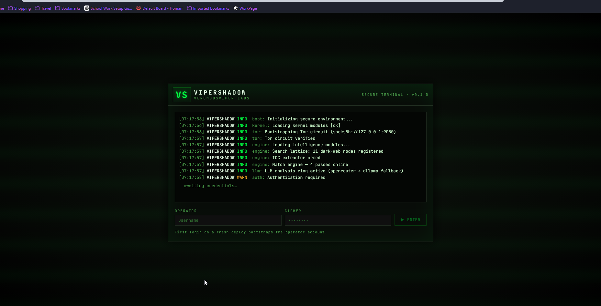
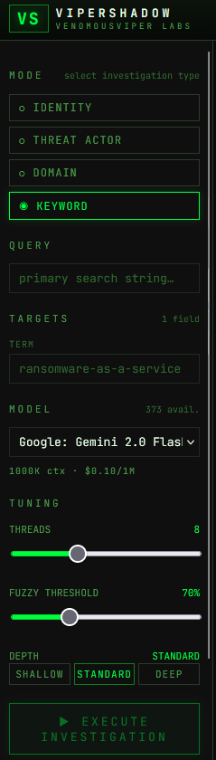
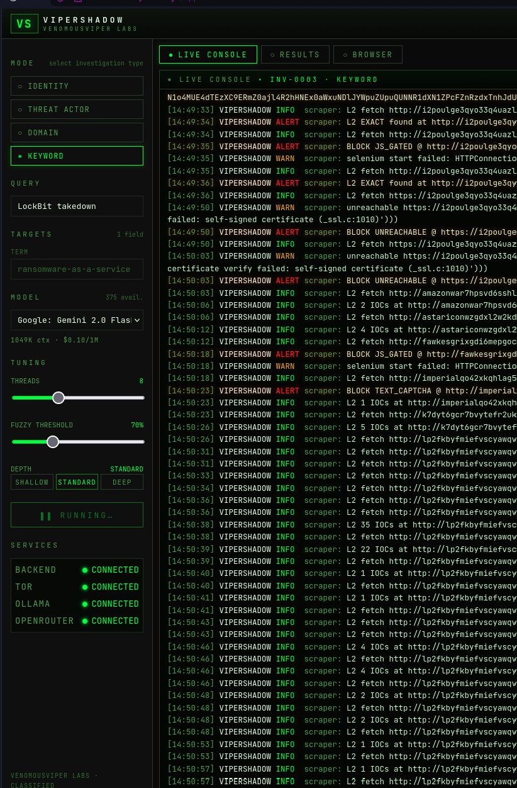
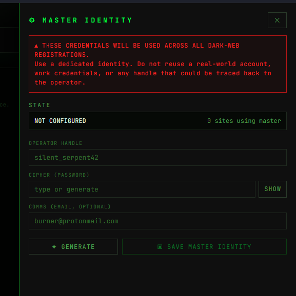
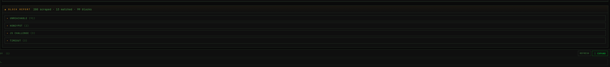
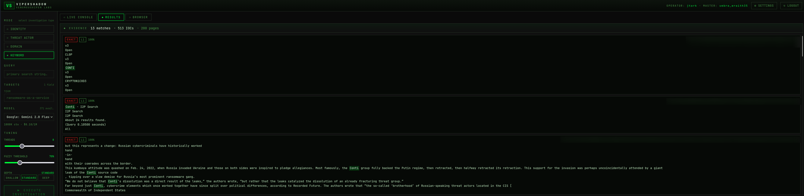

# VIPERSHADOW
### Dark Web Investigation Platform — VenomousViper Labs


> **Note:** Source code is currently private while core milestones are completed. This repository documents the project, its architecture, and current state. Source will be made public once the v1.0.0 milestone is reached.

---

## Overview

VIPERSHADOW is a self-hosted dark web intelligence platform built for security operators conducting investigative work — incident response, threat intelligence, malware research, infrastructure analysis. It combines automated Tor-based multi-layer scraping, a real matching engine, IOC extraction, and LLM-driven analysis into a single interactive investigation interface.

**Part of the VenomousViper Labs security toolkit.**



---

## Why I Built This

Existing dark web tooling forces a choice between shallow and unaffordable.

Free OSINT scanners (Robin, OnionSearch, Ahmia) go one layer deep and return a list of links — no matching, no IOC extraction, no real analysis. Useful as a starting point, not as an investigation tool.

Credential monitoring services (Dark Web ID, SpyCloud, Breachsense) watch a narrow slice of the surface for breached emails and domains on a recurring schedule. They answer one question — "did our credentials leak" — and don't do investigative work beyond that.

Enterprise threat intelligence platforms (Recorded Future, Flashpoint, Intel 471, DarkOwl, Cyble) do real investigation at depth, but cost $50k–$500k per year and assume a dedicated CTI team operating their proprietary UI full-time.

The security operator who needs to actually investigate something — a threat actor, a malware family, exposed infrastructure, a fresh breach — has nowhere to go between those tiers. VIPERSHADOW exists to close that gap: investigation-grade depth, self-hosted, single-operator workflow, no recurring license fee.

---

## How It Works

VIPERSHADOW is an interactive investigation platform designed around the operational constraints of Tor scraping. The pipeline handles the mechanical work — searching, scraping, matching, IOC extraction, LLM synthesis. The operator stays in the loop for judgment calls on gated content.

### Boot and operator setup



Each session begins with a secure boot sequence — Tor circuit bootstrap, intelligence module load, IOC extractor arming, match engine initialization, and LLM analysis ring activation. The operator authenticates against a JWT-protected backend; first-login bootstraps the operator account.

### Investigation configuration



The left panel configures the investigation: mode selection (Identity, Threat Actor, Domain, Keyword), target fields appropriate to the mode, model selection (OpenRouter or local Ollama), thread count, fuzzy match threshold, and scrape depth.

### Pipeline (operational in v0.1)

```
Query → Tor search across 11 engines
     → Multi-layer scraping (L1–L4 with adaptive follow on matches)
     → Match engine (exact, fuzzy-high, fuzzy-low, pattern)
     → IOC extraction
     → LLM synthesis with suggested follow-up queries
```



Live WebSocket console streams pipeline events in real time. Standard-depth investigations typically complete in 10–15 minutes; results, IOCs, and investigation history persist to SQLite.

### Operator-in-the-loop layer (v0.2.0, in progress)

The interactive layer is the current milestone. The intended model:

- **Pre-loaded throwaway identity.** Operator configures a username and password before the scan; the identity loads into memory at scan start. Not generated on-the-fly — Tor circuits on active scrape workers don't tolerate the latency.

- **One-click escalation.** When the pipeline hits a registration wall, the operator gets a prompt: Insert Creds or Skip. Insert fills the saved identity and the scrape continues; Skip drops the source and the pipeline moves on. Decisions are fast — sitting on the prompt drops the Tor connection on that scraper.

- **CAPTCHA passthrough.** The challenge surfaces in the browser panel for the operator to solve interactively. Scrape resumes from where it stopped.

- **Hard blocks land in the report.** Sources the tool can't get past are logged with categorized reasons (REGISTRATION_GATED, JS_GATED, HONEYPOT, TIMEOUT, UNREACHABLE, TEXT/MATH CAPTCHA) so the operator can decide whether to pursue them manually outside the tool.



The browser and registration logic is being completed under the v0.2.0 milestone — see the Roadmap section below for current state.

### LLM drives the investigation forward

Synthesis is more than summarization. The LLM generates suggested **Next Queries** from the evidence — if an investigation surfaces signals worth pivoting on, the report includes pivots the operator can run immediately. The investigation drives itself forward with the operator steering.

The LLM is grounded in extracted evidence and returns explicit **insufficient-data** flags when signal is weak rather than fabricating findings. Each finding in the intelligence report (Threat Actor Profile, Attack Methodology, Infrastructure Indicators, Victim Profile, Current Activity Assessment) is tagged with a confidence rating (HIGH / MEDIUM / LOW) and cites its source.

---

## Operational Model

VIPERSHADOW does not maintain persistent operator personas. Each session uses a single throwaway identity that can be rotated when blocked or banned. There is no long-lived persona, no community presence, no relationship-building on gated sites.

When the pipeline encounters a CAPTCHA, the challenge surfaces in the browser panel for the operator to solve. When a source requires registration, the operator gets a prompt to insert saved throwaway credentials or skip the source entirely. The browser panel is an *operator escalation interface*, not autonomous interaction with gated content.



Block detection categorizes each unreachable source so the operator and pipeline can make intelligent decisions about which sources are worth pursuing and which to rotate away from. This is fundamentally a reconnaissance and triage pattern, not active engagement.

---

## Current State

The v0.1 pipeline is operational and producing substantially more usable intelligence than shallow OSINT tools on the same queries. The depth advantage isn't coming from gated sources — those wait on v0.2.0. It's coming from the multi-layer scraping (L1–L4 with adaptive follow on matches) running against *open* content.

Where single-layer tools grab the matched page and stop, VIPERSHADOW follows references two and three layers deep when matches keep landing — picking up onion addresses, related infrastructure, IOCs, and threat actor mentions surfaced by the references rather than the original search hit.



A single Threat Actor investigation against a well-documented historical target (Conti) produced 13 matches, 513 extracted IOCs, and 200 pages scraped — with the LLM synthesizing five sections of HIGH-confidence findings from the evidence. The v0.2.0 gated-content layer expands source coverage further when complete. The depth advantage on accessible sources is already shipped.

---

## Stack

| Layer | Technology |
|---|---|
| Backend | Python 3.14, FastAPI, SQLite |
| Frontend | React + Vite |
| Scraping | requests + PySocks (Tor SOCKS5) |
| Browser | Selenium + standalone-chromium (Docker) |
| Matching | rapidfuzz |
| IOC extraction | iocextract + custom regex |
| LLM | OpenRouter API (Gemini, GPT, Claude) / Ollama fallback |
| Auth | bcrypt + JWT |
| Deployment | Docker Compose (3-container stack) |
| Egress | Cloudflare Tunnel |

---

## Architecture

```
                  ┌─────────────────┐
                  │  Query Input    │
                  └────────┬────────┘
                           │
            ┌──────────────▼──────────────┐
            │  Tor Search (11 engines)    │
            └──────────────┬──────────────┘
                           │
            ┌──────────────▼──────────────┐
            │  Page Scraper (L1 → L4)     │
            │  Adaptive follow on match   │
            └──────────────┬──────────────┘
                           │
        ┌──────────────────┼──────────────────┐
        │                  │                  │
┌───────▼────────┐ ┌───────▼────────┐ ┌───────▼────────┐
│  Match Engine  │ │ IOC Extractor  │ │ Block Detector │
│  Exact / Fuzzy │ │ Emails, onions │ │ Categorizes    │
│  / Pattern     │ │ wallets, IPs,  │ │ unreachable    │
│                │ │ hashes, CVEs   │ │ sources        │
└───────┬────────┘ └───────┬────────┘ └───────┬────────┘
        │                  │                  │
        └──────────────────┼──────────────────┘
                           │
            ┌──────────────▼──────────────┐
            │   LLM Synthesis (grounded)  │
            │   Intelligence Report +     │
            │   Suggested Next Queries    │
            └─────────────────────────────┘
```

---

## Investigation Modes

| Mode | Target Fields | Best For |
|---|---|---|
| Identity | Email, Username, Full Name, Phone | Breach exposure, credential leaks |
| Threat Actor | Group Name, Alias, Malware | Group profiling, ransomware ecosystem research |
| Domain | Domain, IP | Infrastructure exposure, attack surface review |
| Keyword | Search term | Topical research, emerging-trend tracking |

---

## Roadmap

- **v0.2.0 — Browser & Registration:** Interactive layer for gated content. Selenium-in-container, CAPTCHA passthrough, registration handling, browser session lifecycle.

- **v0.3.0 — Intelligence Quality:** Match engine refinements, IOC noise reduction, deeper LLM analysis, results metadata, paste site / breach DB integration.

- **v1.0.0 — Production Ready:** TOTP MFA, 2captcha optional integration, live screenshot streaming, dead-engine replacement, IOC export in standard threat intel formats, investigation JSON/PDF export. Source code published.

---

## Security Notice

VIPERSHADOW is intended for authorized security research, professional threat intelligence work, and incident response. Not for harassment, doxing, unauthorized investigation of individuals, or any activity that violates law or terms of service.

All traffic routes through Tor. Operator credentials are dedicated throwaway identities — never reuse real-world accounts, work credentials, or any handle that could trace back to the operator.

The tool is designed for reconnaissance and triage, not active engagement with gated sites. Sources requiring active community participation, relationship-building, or persistent identity are out of scope by design.

---

*VenomousViper Labs*
